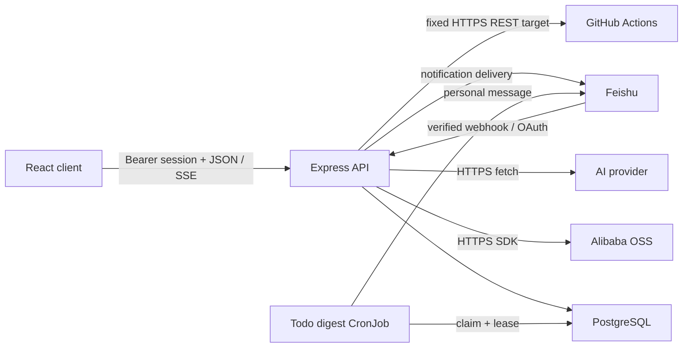

# Architecture

## System Shape

Veges is a single deployable Node.js application with a React client, an Express API,
PostgreSQL persistence, and optional Alibaba OSS, Feishu, and OpenAI-compatible AI
integrations. `docs/personal-project-dashboard-prd.md` records the original product
direction; current code is authoritative where that early document still describes a
single-user, non-collaborative first phase.

The production image builds `src/` into `dist/`, copies `server/`, and starts
`server/index.ts` on Node 24. Express serves both `/api/*` and the client SPA.

## Module Boundaries

- `src/App.tsx`, `src/components/`: UI state and user workflows. They must not hold
  database, OSS credential, or authorization decisions.
- `src/ai-attachments.ts`: browser-side text attachment format checks, display sizing,
  and bounded serialization into a new AI turn. Attachments are
  not uploaded to object storage or assigned project identity here.
- `src/ai-conversation-state.ts`, `src/components/ai-conversation-history-panel.tsx`:
  client-only history navigation, immutable-context selection, pagination merge, and
  responsive history UI. PostgreSQL remains the conversation source of truth.
- `src/todo-proposal-defaults.ts`: pending proposal review defaults for browser display.
  A missing due date becomes the current `Asia/Shanghai` calendar date only while the
  batch remains editable.
- `src/todo-deep-link.ts`: one-shot parsing and removal of the numeric `todo` navigation
  query. The authenticated workspace remains responsible for resolving accessible todos.
- `src/api.ts`, `src/types.ts`: browser API adapter, SSE recovery, and public client-side
  contracts.
- `server/index.ts`: HTTP boundary, authentication, project authorization, request
  validation, Feishu/AI orchestration, and static-file serving.
- `server/ai-provider.ts`, `server/ai-intent-classifier.ts`,
  `server/ai-intent-routing-store.ts`, `server/ai-period-summary.ts`,
  `server/ai-todo-proposals.ts`: shared AI configuration, provider network boundary,
  strict semantic intent JSON, idempotent routing receipts, period facts, and strict Markdown
  proposal parsing.
- `server/ai-workspace-review.ts`, `server/ai-workspace-review-store.ts`: explicit
  workspace-review facts, bounded formatting, authorization-scoped database reads,
  source-project lineage, and history reauthorization.
- `server/ai-todo-confirmation.ts`: the typed PostgreSQL insert contract used when
  confirmed proposal candidates become todos. Reused user-ID placeholders are cast at
  every SQL occurrence so PostgreSQL cannot infer conflicting parameter types.
- `server/ai-conversations.ts`, `server/ai-conversation-store.ts`: conversation domain
  validation, encrypted persistence, authorization, canonical model history, turn leases,
  idempotency, retry/cancel transitions, and artifact links.
- `server/ai-turn-document.ts`: canonical completed project-chat turn conversion,
  in-transaction project reauthorization, and one-source-turn/one-document idempotency.
- `server/ai-turn-stream.ts`, `shared/ai-conversation-wire.ts`,
  `shared/server-sent-events.ts`: bounded response backpressure, canonical turn DTO guards,
  and the server/browser AI stream protocol.
- `shared/ai-input-intent.ts`: the strict public intent DTO and canonical source-content helpers;
  semantic classification runs only on the server.
- `server/todo-digest.ts`, `server/todo-digest-worker.ts`: local-time scheduling,
  deterministic digest formatting, trusted application links, run leases, retries, and
  Feishu delivery.
- `server/organizations.ts`: organization membership, organization-wide read models,
  resource attachment, weekly reports, direct member admission, expiring browser invite
  links, and legacy Feishu-confirmed organization invitations.
- `server/weekly-reports.ts`, `shared/weekly-report-deep-link.ts`: personal weekly-report
  index metadata, drafts, immutable submitted revisions, authorized work-source links,
  organization collection status, AI draft generation, Feishu reminder delivery, and
  authenticated browser deep links.
- `server/changelog.ts`: authenticated global update-log reads, encrypted Markdown
  persistence, and system-administrator-only create/update authorization.
- `server/roles.ts`, `server/organization-scope.ts`, `server/test-workbench.ts`:
  session-scoped business personas, additive organization-administrator capability,
  and resource-scoped read/write authorization boundaries.
- `server/project-package-timeline.ts`: package timeline domain logic, transactional
  aggregate draft saves, one-way publication/completion transitions, encrypted timeline
  fields, document-level todo links, and Markdown export. Publication atomically replaces
  the draft's packages, documents, and document todo links, changes the event to `delivering`,
  and makes document content and package structure read-only. Project members may continue
  managing document todo links, their notes, and todo completion after publication.
- `server/package-market.ts`: OSS configuration, package rules, object-key allowlisting,
  object access, and signed download URLs.
- `server/organization-package-market.ts`, `shared/organization-package-market.ts`:
  organization-scoped package-market feature/channel switches, one shared package
  visibility range, canonical base-package IDs, and authorization helpers shared by
  global and project package selectors. Generic organization feature rows leave room
  for future display settings without coupling those settings to the package rule format.
- `server/image-sync-workflows.ts`: fixed-repository GitHub workflow dispatch with a
  persisted `dispatch_key`, recovery of ambiguous dispatch responses by matching the
  workflow `run-name`, encrypted user-owned run records, bounded Run/Job/Step
  synchronization, per-user admission, successful artifact URI derivation, and
  owner-scoped failed-record cleanup.
- `server/schema.ts`: idempotent PostgreSQL DDL and integrity indexes. Versioned
  incremental statements live in `server/migrations/` and must accompany every
  table, constraint, or index change.
- `server/crypto.ts`: AES-256-GCM envelopes and blind indexes.
- `server/db.ts`: the shared PostgreSQL pool. Domain modules must use one checked-out
  `PoolClient` for every atomic multi-statement operation.

## Request And Authorization Path

Password or Feishu sign-in creates a random session token stored in `sessions` for 30
days. Protected endpoints accept `Authorization: Bearer <token>`. Project-scoped routes
must resolve `getProjectAccess(projectId, userId)` before reading or mutating nested IDs;
owner-only actions add an explicit role check.

`organization_admin` is an additive account capability rather than a session persona.
It allows the account to assume the developer or tester persona. When that
account is also an active organization owner or administrator, read routes may expose all
projects, test spaces, Bugs, comments, and related records attached to that organization.
That dual authorization also permits project-governance mutations for lifecycle status,
health, and milestones. It may also edit and delete todos in projects attached to that
organization; todo completion and acceptance transitions retain their reviewer rules.
Other project mutations continue to use direct project access; test-space and Bug mutations
continue to require membership, creator ownership, or Bug assignment checks. Todo public-link
creation and revocation are another explicit exception: managed organization administrators may
share todos in projects attached to their organization without receiving general project mutation
access.

System administrators identified by `VEGES_ADMIN_USERNAMES` may read organization-attached
projects and todos and may update only a todo's due date, priority, module, assignee, watchers,
or reviewer. This does not make the project writable and does not grant access to unscoped
projects or other todo fields.

The update log is a global authenticated read surface. Its create and update routes require
`isSystemAdmin(username)`, which is derived from `VEGES_ADMIN_USERNAMES`; an
`organization_admin` role does not grant global update-log write access.

`AI_API_BASE`, `AI_API_KEY`, and `AI_MODEL` form one deployment-level provider
configuration. Users never submit or read AI credentials. When that shared provider is
configured, password registration requires an active project or organization invite;
Feishu OAuth can still create or link an internal user. An active organization invite
link also adds the authenticated account to that organization. AI calls
pass both per-user and application-replica
sliding-window limits.

Veges AI conversations are private to the authenticated user and persist in PostgreSQL.
Each conversation has an immutable `general`, `project`, or `conversation-analysis`
context. General chat receives no implicit workspace facts; project context is selected
explicitly by ID and is reauthorized on every list, read, send, retry, and completion path.
Lost project access hides history without rewriting it, while project deletion cascades it.

An explicit current daily or weekly `workspace-review` intent is the only cross-project
exception inside a general conversation. The server loads the authorized project catalog,
the user's own period journals, owner/member-scoped todo activity and actionable backlog,
and current risks. Detail sets are bounded and labeled as samples. The model exposes fixed
progress phases rather than partial project-derived text. Completion locks every source
project in numeric order, rechecks owner or active-member access, and records each project
in `ai_turn_project_sources` in the same transaction as the canonical assistant content.

Before creating a turn, the browser sends the proposed turn UUID, exact content/attachments, and
current explicit context to the semantic-classification endpoint. The server first claims an
`ai_intent_classifications` receipt under that turn UUID, then calls the shared model outside the
transaction with no project or workspace facts and accepts only a strict kind/period JSON object.
The receipt binds the user, keyed exact-input HMAC, and source context; concurrent or repeated claims
return the encrypted canonical result instead of calling the model again. Invalid model output or
provider failure is explicit and never falls back to regex routing. The browser uses only the
bounded classification DTO to choose the immutable conversation context; it cannot submit a
trusted intent. Canonical turn creation locks and consumes the receipt, recomputes the input
digest using the key ID carried by the stored HMAC, verifies the shared deterministic context
derivation, hydrates todo source content from the validated current input, and stores the encrypted
intent in the same transaction as the user turn. Receipts contain only kind/period metadata and
terminal or abandoned rows are removed after a seven-day retention window by bounded opportunistic
cleanup scheduled at most once per minute per application replica with lock-skipping batch claims.
Classification requests have separate per-user/application rate and concurrency limits;
same-turn waiters poll PostgreSQL at a bounded interval and trust the database lease clock. Closing
the classification HTTP request aborts its provider call. An unconsumed completed classification
expires after two minutes, and canonical turn model execution has a separate per-user/application
concurrency limit so valid receipts cannot be stockpiled into a later provider burst. Retry uses the
canonical turn intent and never reclassifies. Canonical duplicate lookup occurs before receipt
consumption; once consumed, a receipt cannot create another turn if its original conversation and
turn were later deleted. Receipt lease and TTL SQL uses PostgreSQL `clock_timestamp()` so time keeps
advancing while a transaction waits for an advisory or row lock.

The browser then sends one user turn with client-generated conversation/turn UUIDs. The server
serializes the first-turn claim with a transaction-scoped advisory lock, stores the
encrypted structured intent and user turn before the provider call, builds model history
from the latest three completed canonical turns, and never trusts client-submitted assistant
history. The same advisory lock makes a concurrent replay wait for the canonical turn before
the rate-limit callback is consumed, while a rate-limited new UUID fails before conversation,
turn, or attachment writes. One partial unique index permits only one processing turn per
conversation. External provider calls run without an open database transaction;
completion writes require the same active lease token and unexpired lease. Cancellation clears
the lease; if cancellation wins before creation, a bounded `ai_turn_cancellations` claim is
serialized by both the conversation lock and a per-user cancellation lock. The claim keeps one
immutable conversation owner for its turn UUID and makes every delayed replay exit before any
provider call. Retry assigns a new lease, and the authenticated reconcile route turns an expired
processing lease into a retryable failure. A duplicate turn UUID with the same payload returns
the canonical turn without consuming another provider request.

Turn creation and retry use a POST response stream with ordered `started`, `delta`, `progress`,
`heartbeat`, `completed`, `failed`, and `cancelled` events. Ordinary chat and conversation
analysis emit text deltas. Project-summary and todo-extraction turns expose only the fixed
`preparing`, `generating`, `validating`, and `saving` phases, so partial provider JSON never
reaches the browser. A heartbeat is sent every 10 seconds; stalled response backpressure is
abandoned after 5 seconds. Closing the browser connection stops transport only and does not
cancel provider work or canonical completion. Explicit stop uses the cancel route. The server
rechecks the active lease and project access before each project-bound delta and before the final
write. Provider text is provisional until `completeAiTurn` atomically saves the final turn and
artifact; the browser reconciles PostgreSQL after an unconfirmed stream end.

Project-bound turn creation/completion, proposal confirmation, and project deletion also
share a project advisory lock. Multi-project confirmation acquires those locks in numeric
order. Deletion then locks conversations and pending batches before the project row, so an
in-flight completion cannot insert an orphan proposal batch and confirmation cannot deadlock
against project removal.

Text attachments are read in the browser and submitted with their source turn. Original
names and content are encrypted in `ai_turn_attachments`; history responses expose only
safe name, media type, size, and ordering metadata, and their SQL path does not select
attachment content. The selected project ID remains a
separate field and is never parsed from attachment text. Pending browser file reads are
invalidated when project or conversation context changes.

Ordinary replies remain in canonical conversation history by default. Converting a completed
project-chat reply into a durable document submits only its conversation and turn UUIDs. The
server acquires the project advisory lock, rechecks active project access, reads and decrypts
the canonical completed `chat` turn, and inserts one encrypted `reply` summary linked by
`source_turn_id`. Reply documents remain visible only to their creating user, even when that user
is a project member, and never serialize back into history as generated-summary outcomes. The
partial unique index makes retries and concurrent requests return the same document. Generated
project daily and weekly summaries keep their automatic document behavior; workspace reviews and
todo extraction do not become documents implicitly.

Personal organization weekly reports use a separate draft-and-publish lifecycle. Editing a
submitted report changes only its encrypted draft; organization management continues to read the
latest immutable submitted revision until the member confirms another submission. AI generation
uses only organization-scoped sources the current user may read and never submits a report
automatically. A genuinely empty editor presents a shared two-item Markdown template; each item has
the ordered `本周进展`, `风险问题`, and `下周计划` fields and is not persisted until the user changes
the draft. AI generation uses the same item-based contract. Selected work sources insert at the active editor selection;
when the selection is inside a heading, insertion occurs immediately below that heading.
Organization collection and reminder actions require both owner/admin organization
membership and the additive `organization_admin` role.
The membership row also stores the organization's long-lived weekly-report assignment. Rule
changes replace that assignee set immediately: only current assignees may create, generate, save,
or submit reports, while prior personal reports remain readable. Collection, reminders, and
organization summaries derive from the same active assignee set.
Weekly-report display order is organization-scoped and stored separately in the nullable
`organization_memberships.weekly_report_sort_order` column. Saving rules replaces both
assignment and position in one transaction. Collection and the ordered assignee DTO use
position, then the existing lowercased display-name/username key, then user ID; unranked
members sort last. Rejoining members have their old position cleared. General organization
membership lists retain their role-based order. Rule examples use the shared report-window
calculation, with day numbers relative to the organization's week start and deadlines in the
following period; invalid drafts never fall back to an example of the default rules.

External entry points have separate trust boundaries:

- Feishu event callbacks require `FEISHU_VERIFICATION_TOKEN`, including challenge
  requests.
- Feishu AI chat is an optional server-side channel adapter, not a second AI engine. It
  accepts only bound users in private chats, persists each inbound message before model
  work, and uses the canonical semantic classification and AI turn lifecycle. Forwarded
  source text and processing errors are encrypted. Group messages never receive project
  or workspace AI data.
- Conversation-analysis webhooks require configured HTTP Basic credentials.
- AI provider URLs must use HTTPS, contain no credentials, resolve only to public
  addresses, and are fetched without following redirects. If system DNS returns only
  `198.18.0.0/15` proxy Fake-IP addresses for a hostname, the provider boundary verifies
  its A and AAAA records through a fixed public DNS-over-HTTPS endpoint before allowing
  the request. Every validated result is pinned to the outbound connection while the
  original hostname remains the TLS SNI and HTTP Host; literal and ordinary private
  addresses remain forbidden.
- OSS endpoints must be HTTPS origins. Package object keys must match configured package
  rules or base templates before storage and again before URL signing.
- Todo and test-workbench evidence uploads require a user session; reads require an
  HMAC-signed object key.

## Data Model

The schema is normalized around these groups:

- Identity: `users`, `sessions`.
- Account roles: `user_roles`; `sessions.active_role` stores a switchable developer or
  tester persona. `organization_admin` remains an additive assignment.
- Organizations: `organizations`, `organization_memberships`, organization invitations,
  expiring `organization_invite_links`, callback replay records, audit events, weekly reports,
  and weekly summaries. Organization
  package-market visibility is stored separately in `organization_feature_settings`,
  `organization_package_market_channel_policies`,
  `organization_package_market_selection_policies`, and
  `organization_package_market_selection_rules`, and
  `organization_package_market_rule_overrides`; missing rows use the enabled/all
  defaults. Release and CI each carry only an independent enabled switch. One
  organization-wide `all`, `selected`, or `excluded` range applies to every enabled
  channel, with rule rows acting as an allow-list in `selected` mode and a deny-list in
  `excluded` mode. Sparse per-component Release or CI overrides take precedence over
  that shared range but never over the market or channel switches. The older channel
  selection rows remain as compatibility mirrors. Dependencies have an organization
  display switch and optional per-dependency channel override, but remain visible only
  when their parent is visible in the dependency's own channel.
  access does not replace general resource write permissions. Active organization owners and
  administrators with the `organization_admin` account role receive organization-scoped
  read access and may govern attached project status, health, and milestones without becoming
  project or test-space members. Each organization stores one
  weekday-based week-start preference, from Monday through Sunday; member reports and
  administrator summaries derive the current seven-day period from that shared setting.
- Product updates: `changelog_entries` stores encrypted title, version, and Markdown content,
  with queryable publication timestamps and nullable creator/editor references. Entries are
  immediately visible after a system administrator saves them; there is no draft or delete
  lifecycle.
- Projects and collaboration: `projects`, `project_memberships`,
  `project_invite_links`, `project_integrations`, `collaborators`.
- Personal image-sync history: `image_sync_workflow_runs` binds each local request to its
  authenticated user, unique `dispatch_key`, and optional GitHub run ID. A partial unique
  index permits one active task per user; image references are encrypted and progress stores
  only bounded job/step metadata. A dispatch timeout keeps the row in `dispatching` while the
  refresh route searches GitHub workflow runs by `run-name` before any new dispatch is allowed;
  unresolved rows expire after five minutes. The progress JSONB remains backward-compatible
  with the original job array while new writes use `{ jobs, runCreatedAt }` so artifact paths
  retain the GitHub Run UTC date. Failed-record cleanup deletes only the authenticated owner's
  local row and never calls GitHub or OSS deletion.
  Project health fields, `project_milestones`, their todo links, and milestone audit events
  are also stored with the project collaboration data.
- Project knowledge: `journal_entries`, `todos`, `project_modules`,
  `todo_activity_events`, `todo_notes`, `todo_note_mentions`, `risks`, `draft_items`,
  `summaries`, `ai_todo_proposal_batches`, `ai_todo_proposals`. Draft items distinguish
  Markdown journal drafts from structured todo drafts. A Feishu confirmation can atomically
  create project-resolved todos and retain unresolved-project candidates as todo drafts; choosing
  a project in the inbox later creates the todo and its activity event transactionally.
- Personal AI history: `ai_conversations`, `ai_intent_classifications`, `ai_turns`,
  `ai_turn_attachments`, permanent deleted
  UUID records in `ai_conversation_tombstones`, and bounded pre-creation cancellation claims in
  `ai_turn_cancellations`. `ai_turn_project_sources` retains workspace-review source project IDs
  without a project foreign key so project deletion continues to make the derived turn
  inaccessible. Summary and todo-proposal outcomes link back through `source_turn_id`.
- Feishu AI channel state: `feishu_ai_chats` binds a private bot chat to the user's current
  canonical conversation and encrypted forwarded source; `feishu_ai_messages` provides
  message-id idempotency, per-chat ordering, leases, bounded retries, and encrypted failures;
  `feishu_ai_callback_events` records successful proposal-card actions.
- Notifications: `notification_states`, `notification_deliveries`,
  `notification_subscriptions`, `notification_digest_runs`.
  A todo may reference one active project member as its assignee, watcher, and designated
  reviewer. These relationships are cleared when that member is removed from the project
  boundary. A missing reviewer keeps the todo creator as the effective reviewer.
  Adding or changing a watcher records the operator and timestamp, exposes a fresh in-app
  notification, and schedules an idempotent personal Feishu delivery. Watcher notifications
  are not sent to the project chat, and unchanged values do not redeliver.
  Todo-note delivery combines the creator, watcher, and explicitly mentioned project
  members into one deduplicated recipient set, excludes the note author, and targets only
  personal Feishu conversations. The note ID and personal target make retries and edits
  idempotent without suppressing a newly mentioned recipient.
  Bug assignment events cross from the test-workbench router into the shared Feishu
  delivery boundary only after a successful create or effective reassignment. The new
  developer always receives a personal card. A project-chat target is resolved only when
  the Bug's test plan has a live project relation; group cards mention that same assignee.
  An assigned Bug starts internally in `pending_confirmation`（界面统一显示为待确认）: the developer either starts
  fixing (`in_progress`) or rejects it with a mandatory reason. Rejection atomically moves
  the Bug to `rejected`, writes an immutable `reject` collaboration comment with the reason,
  and notifies the reporting test engineer by personal Feishu message (and the in-app
  feed); the project chat is never used for rejections.
  `test_bug_events` records the Bug lifecycle for the detail-view timeline: creation,
  assignment/transfer (with the involved assignee), and every status change (previous and
  next status, acting user). Comments are intentionally excluded from the timeline; the
  timeline falls back to the Bug row for creation when no event rows exist yet.
- Package delivery: `project_package_events`, `project_package_groups`,
  `project_package_items`, `project_package_operations`,
  `project_package_operation_todos`, and `project_package_event_comments`.
  Delivery feedback comments are author-owned and encrypted; `@` mentions resolve
  against the project's organization members plus its owner and active members, and
  mentioned users receive a personal Feishu message (never the project chat).
- Testing: `test_spaces`, pending/active memberships, expiring invite links, test subjects,
  case folders and cases, space-level test plans with selected test subjects and immutable
  case snapshots, reusable organization test environments, Bugs, Bug comments, and immutable
  verification delivery snapshots. Each verification submission records either package artifacts
  or encrypted, pinned cluster-image references and writes one linked immutable acceptance
  comment in the status-change transaction. The acceptance record is the sole delivery surface:
  package download URLs are signed only when an authorized reader copies a verification script,
  while cluster-image scripts use the immutable image reference directly.
  Test spaces are an owner-managed authorization boundary independent from projects.
  Test subjects describe the tested object itself and record their creator; only that
  creator may delete the subject and its cascading test data. Test plans may optionally
  link to an accessible project after project access is checked, and also record their
  creator. Only that creator may edit plan metadata, change the selected test-subject
  scope, append current active cases as new immutable snapshots, remove an unexecuted
  snapshot, or delete the plan. Test-case archiving means promoting a functional case
  into a baseline case; it no longer creates a new case version. Deleting a plan
  preserves existing bugs while clearing their plan association.
  Test environments belong to one organization, store encrypted names and access URLs,
  and are assigned to one or more organization-owned test spaces through an explicit
  relation. A Bug may reference only an environment assigned to its own space; database
  constraints clear that reference when an assignment or environment is removed while its
  encrypted environment snapshot remains readable. Only an account with the additive
  `organization_admin` role and active owner/admin organization membership may maintain
  environments. Bug deletion stays creator-owned and requires direct current test-space
  membership. A test-space owner or a direct member who created a Bug in that space may
  change its version label; that narrow permission does not permit other space settings. New
  spaces require an organization and version label, and the encrypted version label has an
  organization-scoped blind-index uniqueness constraint. Bug version editing selects from
  existing versions in the current organization, while create/settings keep text inputs.

Foreign keys define deletion behavior. Deleting an AI conversation first records its UUID in a
tombstone, then cascades its turns and attachments; saved summaries and processed proposal
batches retain nullable source links, while the delete transaction explicitly removes only
linked pending proposal batches. Start and delete share the conversation advisory lock, so a
late turn request cannot race past the tombstone and recreate deleted history.
Already-created todos remain independent. Unique indexes protect active invite
links, membership identity, generated todo notes, one processing AI turn per conversation,
one artifact link per source turn, and one auto-generated operation per package group.
Workspace-review turns are filtered from turn pages, detail/reconcile responses, and later
model history whenever any retained source project is deleted or no longer accessible; the
turn becomes readable again only after access to every retained source is restored.

## Encryption And Integrity

Sensitive text uses the `veges:enc:` AES-256-GCM envelope. Reads accept legacy plaintext
so migration can be incremental; all new writes to protected fields must call
`encryptText`, and all consumers must call `decryptText`. Blind indexes support equality
lookups where ciphertext is nondeterministic.

Protected data includes project names/descriptions/tags, journals, todo titles/details,
activity snapshots and notes, risks, drafts, summaries, Markdown proposal sources and
candidate text, AI conversation titles, turn content, attachment names/content, digest
content, encrypted AI intent payloads, collaborator/member identity fields, package event
titles, package operation titles/content, and operation-to-todo notes.
Test-space names, test-subject descriptions, case content, plan metadata, bug evidence,
and bug comments use the same encrypted-text envelope.
Organization names, invitation email addresses, audit details, member weekly reports,
and generated organization summaries also use encrypted-text envelopes. Invitation
action secrets and organization invite-link tokens are stored only as SHA-256 hashes.
Identity keys, status fields, timestamps, object keys, and relationship IDs remain
queryable metadata.

Atomicity rules:

- A package-item batch validates every item before opening a transaction, then commits
  groups, items, generated operations, and event timestamps together.
- Creating or updating a package operation commits its record, todo links, mirrored todo
  notes, and event timestamp together.
- Todo creation and state changes commit the todo and append-only activity events
  together. Completion or reopen first locks the todo row so concurrent requests observe
  one authoritative previous state and preserve the actual completion actor and time.
- Confirming a Markdown proposal batch locks the batch, its current project access, and the
  referenced project/module/assignee rows. A project conversation cannot redirect candidates
  to another project. Selected todos and activity events commit together; incomplete or
  unauthorized candidates never partially save.
- Semantic intent classification claims a per-turn receipt, commits before calling the model,
  and completes only under the same active classification lease. Canonical turn creation locks
  and consumes the completed receipt, rechecks its exact input digest and derived immutable
  context, then continues with the classified intent. No database transaction remains open during
  either model call.
- Starting an AI turn takes a per-conversation advisory lock, creates or locks the
  conversation, validates the immutable context, allocates a monotonic turn number, stores
  encrypted intent/content/attachments, and installs the lease in one transaction. Provider
  work runs outside that transaction. Completion locks the conversation and turn, rechecks
  project access and lease identity, and returns the canonical turn snapshot from the same
  transaction that commits assistant content plus any summary/proposal artifact.
- Converting a completed project-chat turn into a document takes the project advisory lock,
  rechecks conversation and project access in the transaction, and inserts or returns the
  single summary row selected by the unique `source_turn_id` index.
- Completing a workspace review acquires every source project's advisory and row locks in
  numeric order, rechecks ownership or active membership, records source lineage, and commits
  the assistant response together. Provider work runs before this transaction and emits no
  partial project-derived text.
- Disconnecting Feishu disables the user's daily digest subscription in the same
  transaction that clears the bound identity.
- CSV test-case imports validate the complete file before the first write, then create or
  reuse module folders and insert every encrypted case in one transaction.
- Concurrency safety must be enforced by database constraints plus conflict-safe SQL,
  not by a standalone select-before-insert check.

## Startup And Deployment Boundary

### Bug 分享边界

Bug 分享使用 `/share/bug/<token>` 单页链接。服务端仅保存令牌的 SHA-256 哈希和
加密原文，默认有效期为 30 天，创建新链接会撤销该 Bug 的旧链接。生成和撤销要求
当前 Bug 的报告人、负责人或具备组织资源读取范围的组织管理员；公共读取不要求登录，
返回内容只包含 Bug 展示字段与普通评论，并以 `Cache-Control: private, no-store`、
`Referrer-Policy: no-referrer` 和 `X-Robots-Tag: noindex` 限制缓存、来源和搜索索引。

分享页的评论接口要求登录，但不要求测试空间成员资格；评论始终写入加密的普通 Bug
评论。非负责人登录用户停留在分享页，只能评论。负责人登录后由浏览器恢复该 Bug 的组织
上下文、切换到开发身份，进入已有的负责人 Bug 工作台并沿用原有操作授权。公共页面不返回邮箱、成员名单、内部
链接、附件对象地址、转移或驳回记录。

### 待办分享边界

待办分享使用 `/share/todo/<token>` 单页链接，并与 Bug 分享采用相同的 30 天令牌、
SHA-256 哈希、加密原文、单资源有效链接和撤销模型。链接生成和撤销允许待办所在项目的
Owner、任意有效项目成员，以及同时拥有 `organization_admin` 账号角色和该项目所属组织
有效 Owner/Admin 成员身份的组织管理员。有效项目成员范围自然包含待办创建人、负责人、
验收人、关注人和未承担待办字段角色的普通成员。

公开读取不要求登录，只返回待办的展示属性、详情和未绑定交付操作的普通/验收备注，且
不返回邮箱、权限或活动历史。分享页文档和 API 响应使用 `private, no-store`、
`no-referrer` 和 `noindex`，文档 CSP 仅允许同站图片。登录后可凭分享链接添加加密的普通
待办备注，但不会获得项目成员身份或其他待办操作权限。仅当登录账号本来就拥有项目访问权
时，响应才返回项目 Owner 和有效项目成员中唯一、非空的展示名作为 `@` 候选；候选不包含
邮箱或内部用户 ID，服务端也只为原本拥有项目访问权的留言人解析 mentions。留言与 mentions
在一个事务内写入 `todo_notes` 和 `todo_note_mentions`，并以请求 UUID 保持幂等；服务端按
用户和链接限制请求频率、并发及分钟/每日留言数，提交后复用现有待办备注飞书通知策略。
分享来源留言不接受图片 Markdown，并在公开页按纯文本展示；公开备注列表只返回最近 100
条。原本拥有项目访问权的登录用户可从分享页打开内部待办详情。

Server startup validates encryption keys and executes `schemaSql`; starting the API is a
database mutation, not a read-only smoke test. Versioned files under
`server/migrations/` are the operator-facing incremental DDL record and must be
applied before code that depends on a new structure. The application does not
automatically execute those versioned files, and there is no automatic down migration.
The image-sync surface additionally requires an instance-level `GITHUB_ACTIONS_TOKEN` scoped
to `sealos-apps/sealos-pro` Actions write. It never accepts repository, workflow, ref, or token
values from the browser. Each dispatch carries a server-generated UUID as the workflow
`request_id`; uncertain POST responses remain recoverable until a matching GitHub `run-name`
is found or the five-minute reconciliation window expires. Real dispatch verification consumes
GitHub runner and OSS resources and therefore requires explicit authorization.
The Sealos template provisions PostgreSQL, injects runtime configuration, probes
`/api/health`, deploys one application replica, and runs the todo-digest worker every
five minutes. Digest runs are unique per subscription/date, claimed with row locking and
a lease, retried at most three times, and terminally failed when the last lease expires.
Build receipts and deployment state under `.sealos/` are historical evidence; all three
template image references and both live workload images are deployment sources of truth.

### Test-case directory trees

`test_case_folders.parent_id` is an adjacency list within one test space and test
subject. A composite foreign key prevents cross-scope parents; separate root/child
unique indexes enforce sibling name lookups. Names stay encrypted; full paths are
computed after decryption and are never persisted. Legacy module strings, including
literal slashes, remain root directory names with their original IDs.

`shared/test-case-directories.ts` owns path escaping, depth (32 levels), sibling
validation and import planning. `server/test-case-directories.ts` owns scoped writes.
All directory/assignment writers lock the space, then the subject, then resources;
space imports lock all spaces and subjects in numeric order. Permissions are checked
again inside the transaction. Creator-only case/subject deletion retains its existing
read-access policy; directory management and case reassignment require editor access.
Only directories with no children and no directly assigned cases can be deleted.
Case migration changes assignment and update time only, preserving plan snapshots.

The case workbench keeps tree expansion separate from the desktop panel preference.
Mobile uses an independent drawer. Directory selection clears batch selection;
collapsing the panel or the whole tree preserves case scope and selection. Filtering
and export share the same result set, including every matching page. Import captures
its target on opening and invalidates asynchronous previews when closed or changed.
